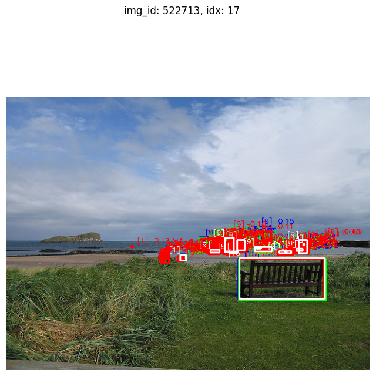
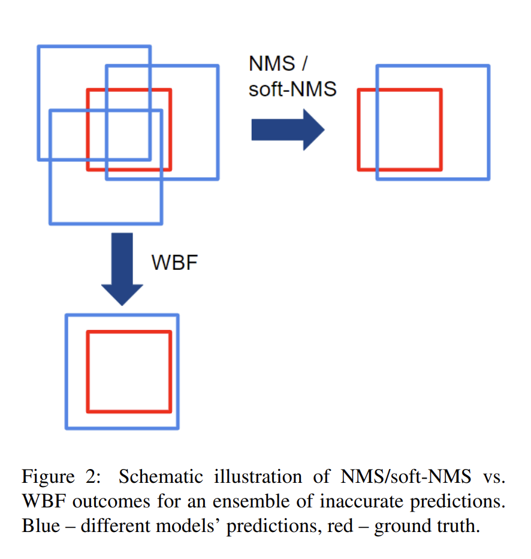

# Ensemble-Object-Detection-using-Detectron2

Ensemble Object Detection Algorithm using Detectron2

## Result

| Models                   | Box AP @(IoU=0.50:0.95, area=all, maxDets=100) |
|-----------------------------|------|
|faster_rcnn_R_50_C4_1x.yaml  | 0.357|
|faster_rcnn_R_50_C4_3x.yaml  | 0.384|
|faster_rcnn_R_50_DC5_1x.yaml | 0.373|
|faster_rcnn_R_50_FPN_1x.yaml | 0.379|
|retinanet_R_50_FPN_1x.yaml   | 0.374|
|retinanet_R_50_FPN_3x.yaml   | 0.387|
|__Ensemble Model__   | __*0.425 (+0.038)*__|


## Getting Started

1. Environments
    - OS: Ubuntu20.04
    - CUDA: 11.3
    - Pytorch==1.10
    - Detectron2==0.6 ([d1e0456](https://github.com/facebookresearch/detectron2/tree/d1e04565d3bec8719335b88be9e9b961bf3ec464))

2. Installation

    ```bash
    sudo apt-get install -y python3-dev python3-venv
    python3 -m venv env
    source env/bin/activate
    python -m pip install pip -U
    python -m pip install -r requirements.txt
    python -m ipykernel install --user --name env --display-name ensemble_detectron2
    python -m pip install "git+https://github.com/facebookresearch/detectron2@v0.6"
    ```

3. Run (reproduce results)
    - open "detectron2_ensemble.ipynb" and run all cells
    - if you don't have GPU, you can utilize results json files without GPU running.
        - open "detectron2_ensemble_no_gpu.ipynb" and run all cells

## Explanation

### Model Selection

| Implementation | Throughpu (img/s) |
| --- | --- |
| __Detectron2 (used)__ | __62__ |
| MMDetection | 61 |
| Detectron | 19 |

  - Used Configuration (model) Name
    - faster_rcnn_R_50_C4_1x.yaml
    - faster_rcnn_R_50_C4_3x.yaml
    - faster_rcnn_R_50_DC5_1x.yaml
    - faster_rcnn_R_50_FPN_1x.yaml
    - retinanet_R_50_FPN_1x.yaml
    - retinanet_R_50_FPN_3x.yaml

### Ensemble Method

Object detection 분야에서 많이 쓰이고 성능이 검증된 **Weighted Boxes Fusion** 방식을 사용하여 ensemble 을 적용하였고, `0.387`에서 `0.425`으로 `0.038` 증가한 결과를 얻을 수 있었다.

시작은 ensemble을 위해서 기본적으로 voting 방식을 취하기 위해 hueristic 한 method 는 아래 그림과 같이 score (confidence) 대비 over-detection 되는 object들이 너무 많았고, 이러한 여러개의 모델들에서 더 높은 정확도를 가지는 box를 찾아내기가 쉽지 않았다.



위 그림에서 흰색 박스가 ground truth 이고, 각 색상별로 다른 모델의 detection 결과를 시각화 하였다. 보이는 것처럼 over-detection 된 물체가 너무 많아 ensemble 전략을 만들기가 쉽지 않았다.

위와 같은 이유로 object detection 분야에서 많이 쓰이는 ensemble method를 찾아보았고, NMS (Non-Maximun Suppression), Soft NMS 방법을 개선한 Weightd Boxes Fusion 방법이 많이 사용되고 있으며, 좋은 성능을 보여주고 있음을 확인하였고, 이를 적용해보았다.



Weighted Boxes Fusion 방법은 기존에 NMS/Soft NMS 방법이 IoU Threshold 값에 따라 필요없는 detection 정보를 지워버리는 것과는 달리, detection score를 이용하여 weighted box 를 구하는 방법을 취한다. 이를 통해 하나의 물체를 여러 모델이 검출하였을때 score가 가장 높은 하나의 결과만 사용하게 되는 기존 방법들과 달리 모든 검출 결과를 score에 따라 반영하는 fusion된 결과를 얻을 수 있다.
Weighted Boxes Fusion 방식은 여러모델에서 검출된 Box들을 clustering 하고 이를 fusion 한 Box list를 구성한다. 새로운 box는 fusion box list 와 비교하고 IoU threshold 를 넘기면 clustering 된 box list 에 추가하고 fusion 결과를 업데이트 하는 방식을 취한다.


## Reference

- [Detectron2](https://github.com/facebookresearch/detectron2)
- [Detectron2 Install](https://detectron2.readthedocs.io/en/latest/tutorials/install.html)
- [COCO Dataset](https://cocodataset.org)
- [Weighted Boxes Fusion](https://arxiv.org/pdf/1910.13302.pdf)
